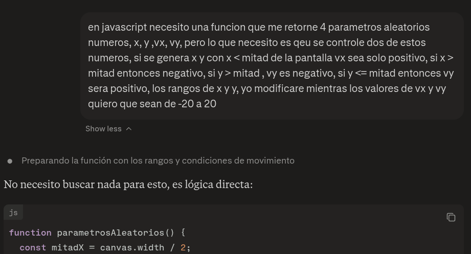

# Construccion del proyecto

## Estructura del proyecto

Para un modelo MVC tomamos en cuenta este documento de internet [documento](https://www.scribd.com/document/983292526/Recitation-8)

## Asteroide

- Para la generacion de coordenadas aleatorias, utilizamos la IA para los calculos del tamaño del canvas. La version final tuvimos que modificar para ajustar a nuestras necesidades.
  

- La funcion crearAsteroide, como tenemos dos tipos de asteroide, tuvimos que repetir el codigo.

## Balas

- Para la generacion de balas teniamos un error, que las balas no tenian una direccion, entonces intuimos que se tenia que utilizar lo mismo para la rotacion de la nave.

## Colisiones

- En las particulas tuvimos que utilizar la formula de seno y coseno para que avance en una direccion del plano del que salen disparadas.

## Nave

- Para el movimiento de la nave, como rotacion con formula seno y coseno, nos apoyamos con la ayuda de la inteligencia artificial.
- Se ayudo con IA como implementar el eventListener para la captura de las teclas para el movimiento de la nave.

## PantallaJuego

- Para la parte de colisiones, balas contra meteoritos y meteoritos contra la nave, se saco de [videos tutoriales youtube](https://youtu.be/mFlhxnmel8M?si=cZkNip49AyuZcQQ_), tiempo = 1:40h.
- En reiniciarJuego() y gameOver(), hay una llamada de una funcion `cancelAnimationFrame()` y `clearInterval()` fue una sugerencia de la IA por que el estado del juego deberia empezar de nuevo.

## Score

- El archivo leaderBoard y score, para las modificaciones de la UI, como los innerHTML y CSS se utilizo inteligencia artificial.

## UI

- Para actualizar la barra de estado de las balas y las vidas en la interfaz, nos apoyamos con la ayuda de la inteligencia artificial, modificando asi el archivo pantallaJuego y el CSS.
- Para el boton de gameOver e iniciarJuego se busco como sobreponer a la pantalla con inteligencia artificial.
